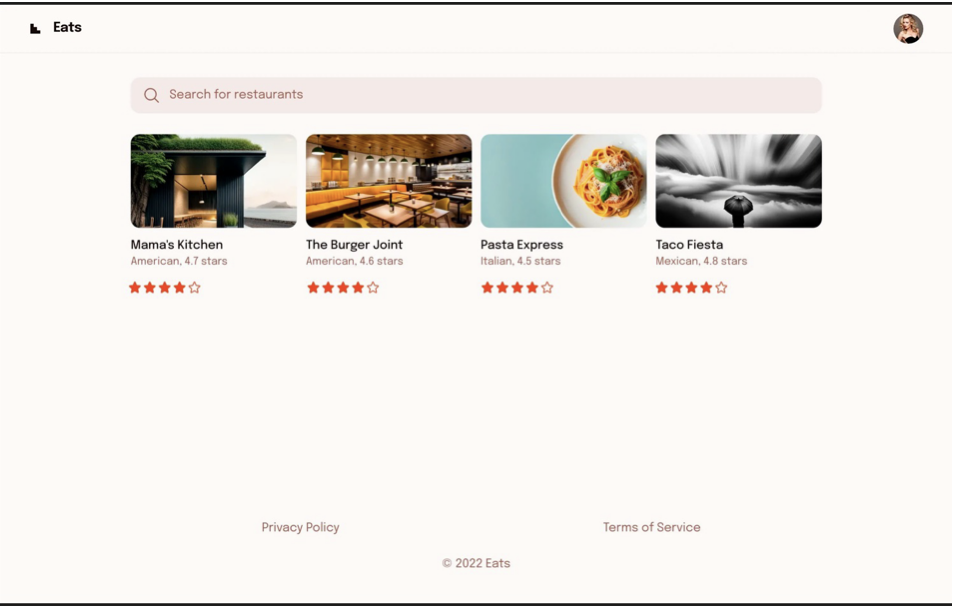

# Restaurant Rating

This is a small application for searching and rating restaurants.

I developed it as part of the module "Project Structure and Basic Architectural Patterns" from the React.js course by Skillbox as a practical assignment for the module.

## Goals

- Learn how to create an application from scratch;
- Learn how to define a clear file and folder structure for a project;
- Reinforce skills in working with data in React components and understanding the concepts of controlled and uncontrolled components.

## Task and Development Stages

The task was to develop a "Restaurant Rating" application from scratch, following a design mockup:

*Image: Alexander Gaidarzhi*

1. Implement the main abstract components: search, restaurant card, logo, and user avatar.
2. Add custom styling to the main components. Achieving exact visual matching with the design is not necessary.
3. Implement the main page component, which will manage the abstract components from the previous step. Its task is to send a request to retrieve a list of restaurants and display a loading state during the request. After a successful request, the list of restaurant cards should be displayed based on the received data.
4. Additionally, add a search field that will filter restaurants by name. When clicking on the rating component, a request should be sent to update the restaurant's rating. Implement the functionality for changing the restaurant's rating. The request should be initiated not by the restaurant card but by the page component that renders these cards.

## My Contributions to the Project

- I slightly modified the design: adjusted the colors, worked on the positioning, and tweaked element margins. I simply wanted to make the design more visually appealing to myself.
- Implemented error handling for requests and for cases where no search results are found.
- Enhanced the data structure. Initially, it was assumed that the restaurant description would be a single string. However, I wanted the type and rating of the restaurant to be separate properties.
- The restaurant rating component was implemented in such a way that when hovering over it, the user can set a rating for the restaurant. I did not implement a version of this functionality for mobile devices, but most likely, I would use a modal window to allow the user to select a restaurant rating. When clicking on any of the stars, the restaurant rating is sent to the server.
- All ratings given by users (the project is greatly simplified—there is no personal account or user management) are stored in an array of ratings. With each new rating added, the restaurant's overall rating is recalculated considering all the ratings in the array.

## Running the Project

1. Ensure you have Node.js installed (the version used during development was 20.11.0).
2. Install dependencies by running: `npm install`.
3. Run the server with the `npm run api` command.
4. Start the project with: `npm run dev` command. This will start a local development server. Open your browser and navigate to [http://localhost:5173/](http://localhost:5173/) to see the result.
5. To build the project for production, run: `npm run build`. The built files will be located in the `/dist` directory.
6. To preview the built project, use: `npm run preview`. This will start a local server for previewing the built project.
